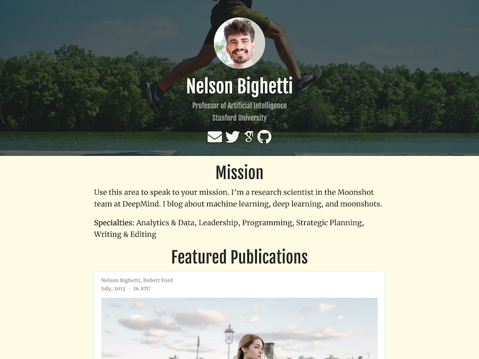

# Researcher Template for [Hugo](https://github.com/gohugoio/hugo)

### Exclusive to [Sponsors](https://github.com/sponsors/gcushen): ❤️ Thanks for your support ❤️

The Researcher template enables you to quickly create a resumé with publications. **Check out the steps below to get up and running fast.**

[Check out the demo](https://hugo-researcher.netlify.app/) of what you'll get in less than 10 minutes, or [be inspired by user stories](https://wowchemy.com/creators/).

## License 

This template/theme is licensed to sponsors of George Cushen (sponsoring via GitHub Sponsors or Patreon) under the Sponsor License (see attached `../../LICENSE.md`).

## Get Started

We'll use a Markdown editor, Typora, to edit your site, then upload it to GitHub, and deploy it with Netlify. No need to install Hugo 😃

**Why GitHub?** So you can edit your site with collaborators, track changes, and request assistance from the community if needed.

**Why Netlify?** Netlify makes it easy to deploy a Hugo/Wowchemy site for free whilst giving your visitors the fastest experience.

**Get Started:**

1. Download this template (such as from GitHub by clicking the green _Code_ button and then _Download ZIP_)
1. Extract the ZIP in your _Downloads_ folder
1. Download [Typora](https://typora.io/), open the app, and choose _File > Open_ to open the extracted folder
1. Edit your **profile** in `content/authors/admin/_index.md` - add your name as the `title` and optionally, a role/tagline and your organization
1. Add your **resume/CV** to `static/uploads/resume.pdf` or delete the example resume file and remove the link to it in `content/authors/admin/_index.md`
1. Add a square-cropped **photo of yourself** named `avatar` to the `content/authors/admin/` folder to replace the example photo
1. Add a **background photo** to `static/media/hello.jpg` (ideally, resize to max 2500px wide, crop to a banner shape, and [optimize it](https://tinypng.com/))
1. Add your **contact details** in `config/_default/params.yaml`
1. Add your **bio** to `content/home/bio.md`
1. Add your **experience** to `content/home/experience.md`
1. Add your **education** to `content/home/education.md`
1. Add your **accomplishments** to `content/home/accomplishments.md`
1. Add any **publications** to `content/publication/` (or delete the folder along with the `home/featured.md` and `home/publications.md` sections)
   - **Have many publications?** Consider using the [Academic CLI](https://github.com/wowchemy/hugo-academic-cli) tool to batch import publications from Bibtex
1. Add any **events/talks** to `content/event/` (or delete the `event` and `slides` folders along with the `home/talk.md` section)
1. [Create a Project (Repository) on GitHub](https://github.com/new), choose a _repository name_ like `my-site`, choose public or private, and then _Create Repository_
1. **Upload your site** by clicking the _uploading an existing file_ link and then click _choose your files_ to select all the files in your site folder (not the folder itself)
1. Login to [Netlify](https://app.netlify.com/), click _New Site from Git_, and login to GitHub to select your new site
1. **Personalize your site URL** in the Netlify dashboard or add your [domain](https://wowchemy.com/docs/hugo-tutorials/domain/)
1. Edit the site details in `config/_default/config.yaml by navigating to the file in GitHub and clicking the pencil button - add your name as the site title and **add your URL**
1. Netlify will automatically update your site at the new URL within a few minutes

- 📚 [View the **documentation**](https://wowchemy.com/docs/)
- 🚑 **Solve common issues** with the [Troubleshooting Guide](https://wowchemy.com/docs/hugo-tutorials/troubleshooting/)
- 💬 [Chat with the **Wowchemy community**](https://discord.gg/z8wNYzb)
  - Please ask general questions in the _#need-help_ channel
  - Please ask questions specific to this template in the _#supporters-lounge_ channel
- 🐦 Share your site on Twitter: [@wowchemy](https://twitter.com/wowchemy) [@GeorgeCushen](https://twitter.com/GeorgeCushen) [#MadeWithWowchemy](https://twitter.com/search?q=(%23MadeWithWowchemy%20OR%20%23MadeWithAcademic)&src=typed_query)

## Credits

Example photos:

- [Running](https://unsplash.com/photos/ybLtRkjHprE)
- [Profile](https://unsplash.com/photos/KzRz25tmjWc)
